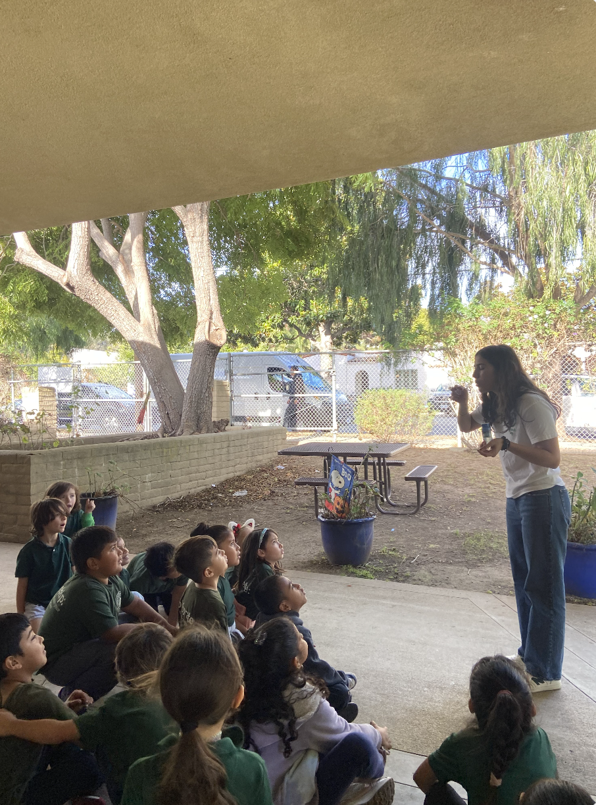
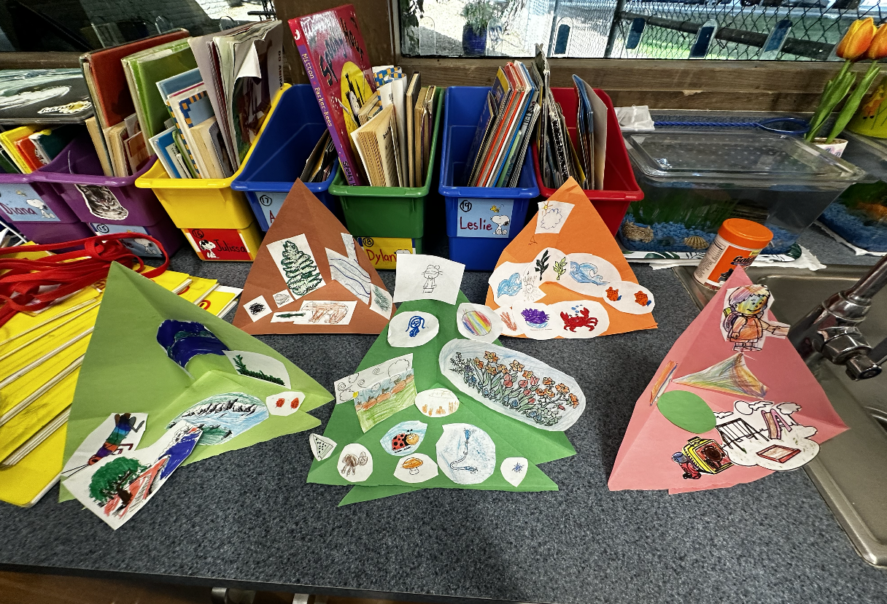
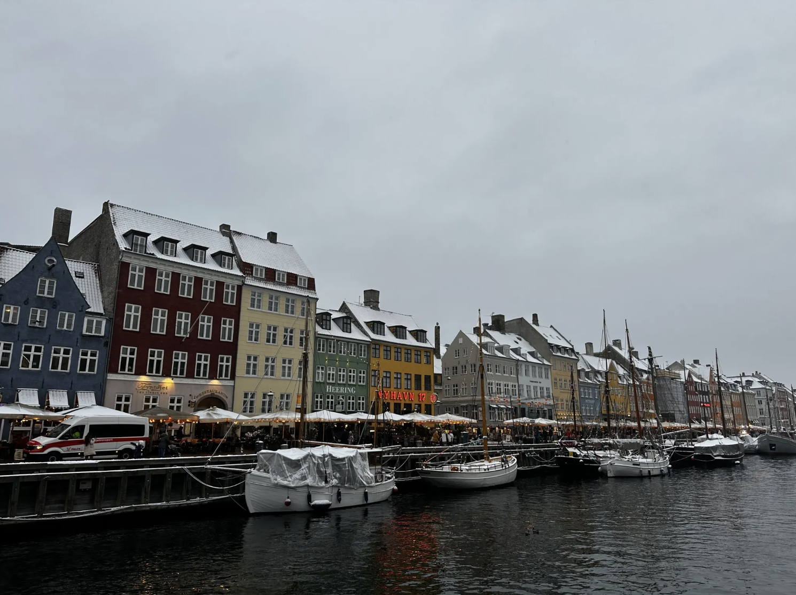
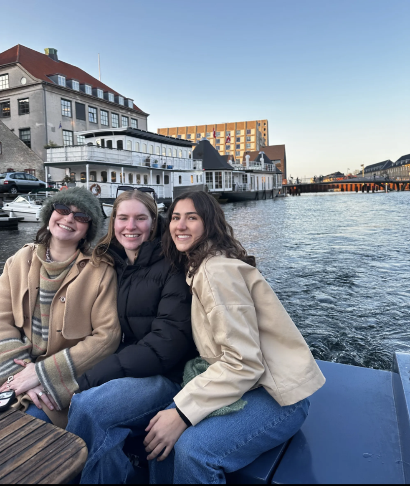
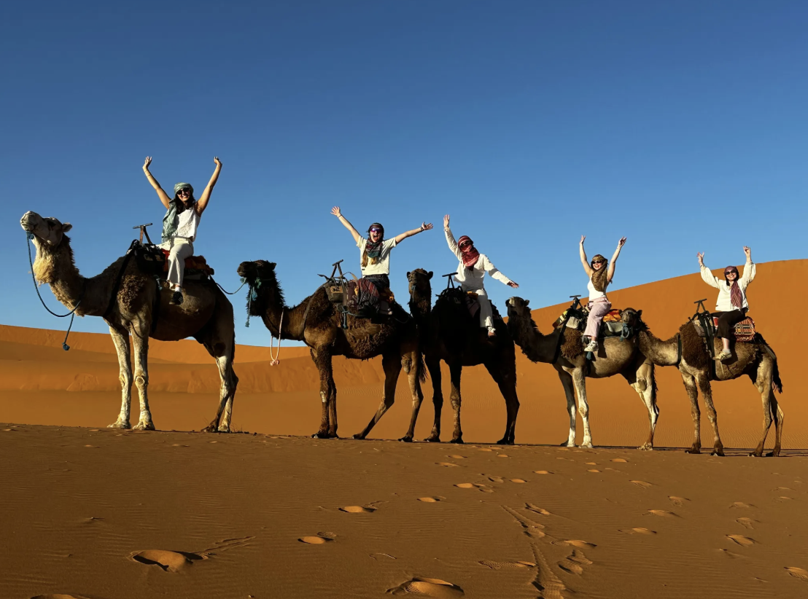

# My Background

I grew up in Palo Alto, California with my older brother, Luc. My maternal grandparents lived nearby, and were very present in my childhood. I have fond memories of taking walks with my grandparents, collecting leaves and flowers to take home and make art with. Similarly, my mom raised me to be passionate about the environment, and she is the reason I chose to major in environmental studies. I feel lucky to have been raised in northern california with access to so much nature, and to have so much family close by. 

# Sprout Up UCSB

I am the program manager for Sprout Up at UCSB, a campus organization where UCSB students go to Title 1 elementary schools in the area to teach environmental education. Learn more about [Sprout Up](https://www.sproutup.org/). 

I joined this club during my first year in spring. I really enjoyed being a teacher and loved the community I gained from being part of this organization. I decided to join the executive board, and decided to take over the position of "program manager". This position involves managing communication with other teachers and staff, outreach to Title 1 schools to find participating classrooms, interviewing applicants, facilitating trainings, and scheduling events. I have learned a lot in this position, and have built such strong relationships with other members, especially others on exec.  

I joined this club during my first year in spring. I really enjoyed being a teacher and loved the community I gained from being part of this organization. I decided to join the executive board, and decided to take over the position of "program manager". This position involves managing communication with other teachers and staff, outreach to Title 1 schools to find participating classrooms, interviewing applicants, facilitating trainings, and scheduling events. I have learned a lot in this position, and have built such strong relationships with other members, especially others on exec.  

::: {layout="[[1, 1,]]"} 

{.lightbox style="display: block; margin: auto; height: 300px;" group="sprout"}

{.lightbox style="display: block; margin: auto; height: 300px;" group="sprout"}
:::

# Study Abroad

An experience that had a big impact on me is my seventh month study abroad experience during my third year of college. I decided to study in Copenhagen, Denmark becuase the Unviersity of Copenhagen offered many environmental studies classes in english. I ended up taking three environmental studies classes; "Applied Ecosystem Ecology", "Human Adaptation to Change and Variability", and "Thematic Course: Towards the Green Transition in Africa". It was interesting to get a different perspective on environmental issues I have learned about in many classes at UCSB. 

During this time abroad I was able make new friends, gain independence, and reflect on my future. Through an internship, I was able to gain insights into what I wanted to do post grad. I also got to travel around Europe (+ Morocco) and made unforgettable memories. I am so greatful for my time abroad and it was truly one of the best experiences I have ever had. 

When I returned from study abroad I got a job at the UCSB Education Abroad office as a peer advisor. In my role, I wrote a blog post regarding my time abroad. Check it out [here](https://ucsbeapblog.wordpress.com/2026/02/24/sophie-p-denmark-university-of-copenhagen-environmental-studies/). 

::: {layout="[[1, 1, 1]]"} 

{.lightbox style="display: block; margin: auto;" group="abroad"}

{.lightbox style="display: block; margin: auto;" group="abroad"}

{.lightbox style="display: block; margin: auto;" group="sprout"}
:::

