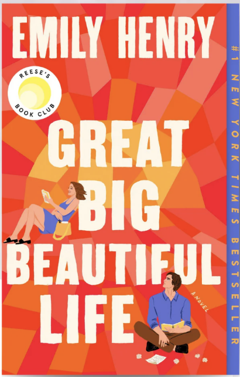
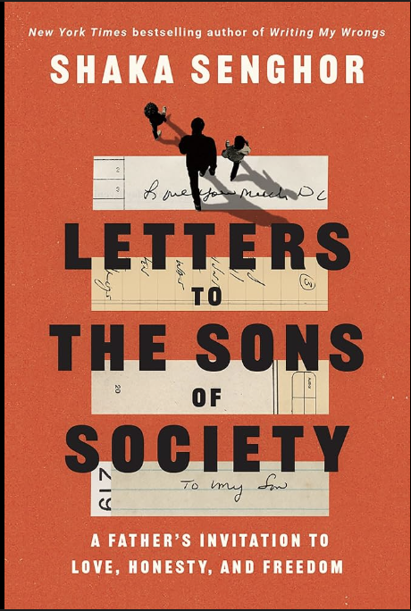
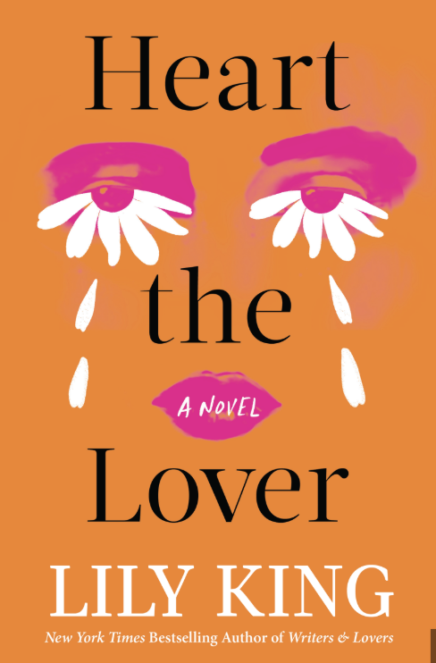

## Books I've Read in 2026

<b>Great Big Beautiful Life – Emily Henry</b> 
A thoughtful and emotional story about love, identity, and personal growth.

January 2026

<b>Letters to the Sons of Society – Shaka Senghor</b> 
A reflective and powerful collection of letters exploring masculinity, healing, and justice.

February 2026

<b>Heart the Lover – Lily King</b> 
A lyrical and intimate novel about relationships, longing, and emotional connection.

March 2026

